# Z Layouts

The purpose of the ZLF (Z Language Fabric) is generally not to change any workable coding styles, but more to reinvent them and improve them. For this reason, the writing style has been largely copied from other languages, with some differences.

### Comments

Comments use the following notation:

```html
<!-- Comment (Change ending to --!> once complete) -->
```

They are ignored by the compiler and are mainly intended for developer use.

## Basic Controls

A **control** is a component of a page, like a button, or text, or the navigation bar. Each control has an associated **tag**. Tags are just “words” to represent the controls, which are used in various contexts. The tag for buttons is `button` the tag for navigation bars is `nav`. 

​	Notes:

* Tag names of simple features start with decapitalized letters, while tag names of advanced features start with capital letters. 
* Z uses camel case notation over underscores. You may implement your own controls using underscores if you like.

#### Tags

A tag containing text will look like this:

```html
<tag/>Some text.</tag>
<tag/>
    Some more text.
</tag>
```

The control associated with the tag will determine how the tag appears. Overall, there is no difference between the above two formats in terms of the final result produced. One format might be preferred over the other in difference situations.

Alternatively, tags may be isolated, without containing any text:

```html
<tag>
```

Note the difference in the placement of the colons `:`.

Tags can also have inputs when required.

```html
<tag [type](input)>
<tag [type](input)/>
    Content.
</tag>
```

 Finally, tags can be associated to a variable.

```html
<tag (input) @variable>
<tag (input) @variable/>
    Content.
</tag>
```

> Note the change in notation from HTML. As much as it does, this is not intended to confuse experienced HTML Developers, but to make it intuitive for new learners. The forward slash `/` now represents the boundaries of the contents of the tags. No `/` means no content, `<tag/>` means the tag has been initiated, and `</tag>` means the completion of the tag’s contents.
>
> Overall, I feel this will make the change in notation easier to learn.

### Anatomy

Anatomy controls isolate the main parts of the webpage from one another. They’re at the fundamental level of the web page.

#### Head

The head contains the background and preliminary information for a page’s programming and layout.

```html
<head/>
    <title/>The Title is here.</title>
    <excerpt/>This is an excerpt for this page. The excerpt shows a quick summary for search engines. This page is just a sample.</excerpt>
    <design ("home.z1")>
    <import ("ComboBox.zc")>
</head>
```

This contains the page title and an excerpt. The excerpt is used for searches. 

In addition, it’s used to link the associated design files to the page and import any custom designed controls, which we’ll get to later. 

#### Body

The body contains the main content of the page. All the text, images, navigation, etc. goes here. However, it’s generally not necessary to make any design changes just yet.

```html
<body/>
    
</body>
```

Everything in the essence of the page goes into the body section.

### Text

#### Headings

Headings are for grouping paragraphs under a similar context. They’re large text to capture the representation the offer the text. They’re written as `h` followed by a number. There’s a total of 6 different headings.

```html
<body/>
    <h1/>Heading 1</h1>
	<h2/>Heading 2</h2>
	<h3/>Heading 3</h3>
	<h4/>Heading 4</h4>
	<h5/>Heading 5</h5>
	<h6/>Heading 6</h6>
</body>
```

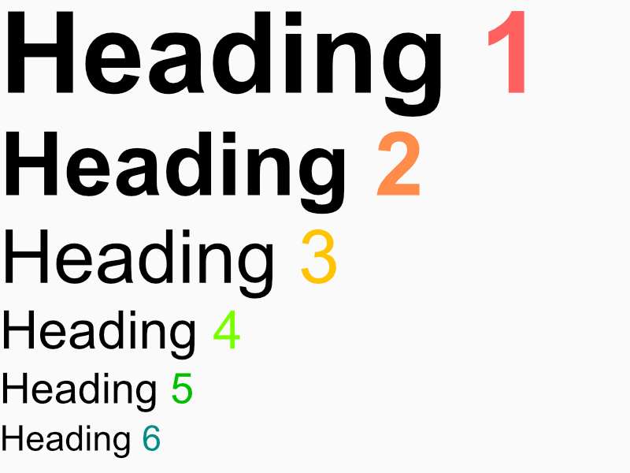

By default, the headings are in Arial, and the paragraphs (which are next) will be in Times New Roman. Again, you will have the option to change this later.

#### Paragraphs

Paragraphs are another tag in Z. They’re represented and shortened to the `p` tag due to ease of use, given how common they are.

```html
<body/>
    <p/>
        <LoremIpsum (1)>
	</p>
</body>
```

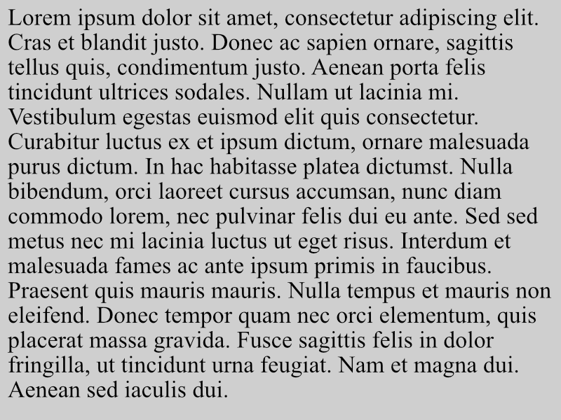

The above contains the Lorem Ipsum dummy text. The `(1)` argument shows the first paragraph. The above text is not to scale with the headings. 

#### Clause

A clause represents a part of a sentence in Z. It’s typically a child of a paragraph. There’s no difference in formatting in clauses than paragraphs. They can be edited differently in their [design](../2 Design/_Design.md) as desired. They are shortened to a `cl` tag.

```html
<p/>
	A <cl/>clause</cl> is a <cl/>section of a paragraph</cl>. They can be edited as desired in the design section.
</p>
```

> For those of HTML background, clauses replace spans. The concept of a span is used for measurements.

#### Quote

A quote is a special type of a paragraph with it’s custom formatting design for quotations.

```html
<p/>Here's a quote:</p>
<quote ("~ Julius Caesar")/>It is easier to find men who will volunteer to die, than to find those who are willing to endure pain with patience.</quote>
```

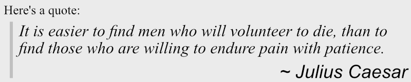

#### Text Formatting

Text formatting involves changing the colour or text or making it bold, italicized, underlined, or strikethrough. 

```html
<p>
    <#red/>This text is red</#red>.
</p>
```

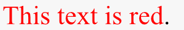

Various coloring options will be added. 

You can always create your own colours using the hexadecimal coloring code. The coloring in Z uses both RGB and RGBA formats. The colouring code is also generalized as follows:

* `#G`: Single Precision Greyscale.
* `#GA`: Single Precision Transparent Greyscale.
* `#RGB`: Single Precision Colour.
* `#RGBA`: Single Precision Transparent Colour.
* `#RRGGBB`: Double Precision Colour.
* `#RRGGBBAA`: Double Precision Transparent Colour.

The following example covers **bold**, *italics*, <u>underline</u>, and ~~strikethrough~~.

```html
<p/>
   <b/>Bold.</b> <i/>Italics.</i> <u/>Underline.</u> <s/>Strikethrough.</s>
</p>
```


#### Font

Font can be changed through an inline design edit.

```html
<p>This is the default font for paragraphs.</p>
<p |style {font: "Calibri"}/>This paragraph is in Calibri font.</p>
```

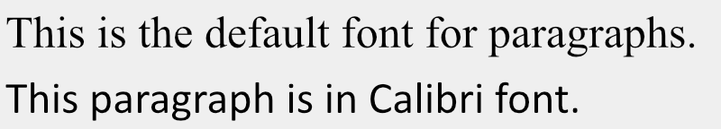

The style bit will be explained later in the design section. But what you’ve seen now is an example of an **inline design edit**.

### Numbers

A tag for numbers. This stores numbers specifically. It has its conveniences when we reach the [programming](../4 Programming/_Programming) aspect of Z.

#### Int

Basic integers, includes negative numbers and 0 if desired. For integer ranges, use `int[a:b]`. This gets the integers between a and b. 

```html
<body/>
    <int/>-12</int> 
	<int/>0</int> 
	<int/>284</int>
	<int [0]/>0</int> 
	<int [0:12]/>6</int> 
	<int [0:]/>83</int> 
	<int [:0]/>-50</int> 
<!-- <int [5]/>0</int> will be ignored and raise an error. Does not qualify under its type. -->
<!-- <int [1:]/>0</int> will be ignored and raise an error. Does not qualify under its type. -->
<!-- <int [-12:8]/>63</int> will be ignored and raise an error. Does not qualify under its type. -->
</body>
```

There’s no special formatting for integers. They’re treated as individual clauses.

#### Floats

Decimal values for making computations about incomplete quantities.

> For those from other programming languages, Z only uses double precision floating points.  

```html
<p/>pi is <float/>3.14159</float>.</p>
<p/>e is <float/>2.718</float>.</p>
<p/>One half is <float/>0.5</float>.</p>
```


#### Ratios

Ratios and fraction allow for simpler computations of fractions. It’s worth noting that they’re not necessarily faster than floats. By default, ratio’s will be displayed with a colon `:` as opposed to a slash `/` as used in fractions. 

```html
<p>One-third is <ratio/>1/3</ratio></p>. 
```


#### Span

Span are for measurements. They are only read if they end in the defined measurable unit. or contain numbers only.

```html
<span [int](px)/>12px</span>
```

Acceptable units are: px, pt, in, cm, ft, etc.

Note that if it does contain only numbers, the units will be added to the end by default. You can change the formatting later when you get to the [Design](../2 Design/_Design.md) section.

The `[int]` denotes the span is an integer type. These are for templated types.

```html
<!-- One foot in different measurements given a dpi. -->
```


### Lists

List are a set of ordered items and are represented with the `l` tag. They contain immediate children `li`. 

```html
<l/>
    <li/>Item 1</li>
    <li/>Item 2</li>
    <li/>Item 3</li>
    <li/>Item 4</li>
</l>
```

The default list above only indents the items.

#### Ordering

Use `l (0)` for unordered lists and `l (1)` for ordered lists.

```html
<p> An unordered list:
<l (0)/>
    <li/>Item 1</li>
    <li/>Item 2</li>
    <li/>Item 3</li>
    <li/>Item 4</li>
</l>
</p>

<p> An ordered list:
<l (1)/>
    <li/>Item 1</li>
    <li/>Item 2</li>
    <li/>Item 3</li>
    <li/>Item 4</li>
</l>
</p>
```

The argument stands for “increment”. An increment of 0 means the numbering of the list items don’t increase or decrease, and so the list is unordered.

#### Menu

A menu is a list of buttons that link to a different page. They inherit [a](####Links) (for links) and lists. Use argument `menu` for making menus. 

```html
<p> An unordered list:
<l (menu)/>
    <li/>Item 1</li>
    <li/>Item 2</li>
    <li (1)/>Item 3</li>
    <li/>Item 4</li>
</l>
</p>
```


Item 3 is selected. Item 2 is being hovered over. Too many items in a menu is generally discouraged.

#### Dropdown List

The argument is `drop` for dropdown lists.

```html
<p> An unordered list:
<l (drop)/>
    Initial Text.
    <li/>Item 1</li>
    <li/>Item 2</li>
    <li/>Item 3</li>
    <li/>Item 4</li>
</l>
</p>
```

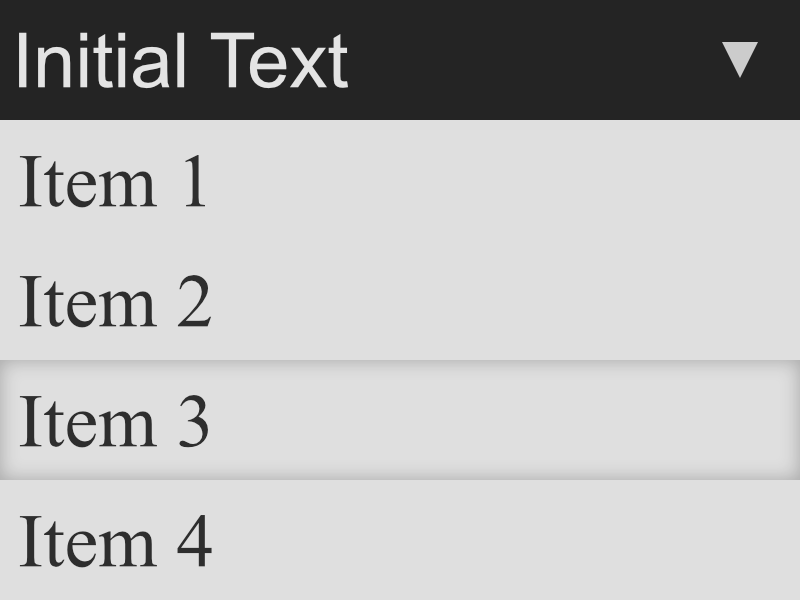

Again, Item 3 is being hovered in this example. 

### Inputs & Forms

Inputs and forms are for taking user input. They use the `in` tag.

#### Combo

Combo boxes are different than dropdown menus in that an item can be selected.

Their initial view and behaviour is similar to a 

#### Text

Text inputs can be in the form of lines or blocks. 

```html
<in (line)>Write text here.</in>
<in (block)>Write text here.</in>
```

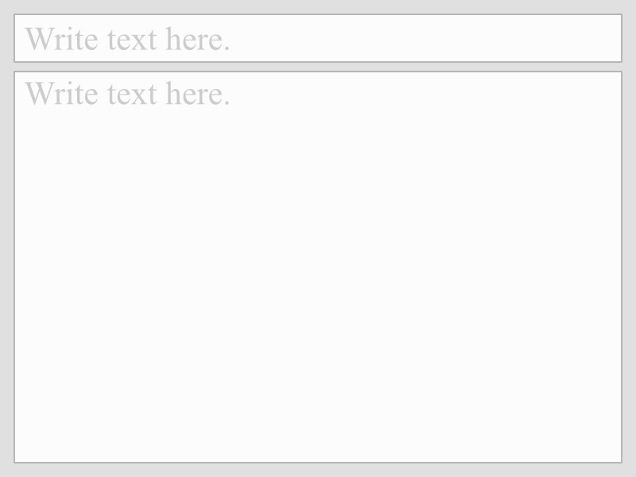

#### Numbers

Here’s an example that combines user input with code insertion.

```html
<p/>
    Pick two numbers:
</p>
    
<in [0:999] @x>
<in [0.00:1.00] @y>
    
<p/>
	Their sum is @x + @y = {@x + @y}. 
</p>
```

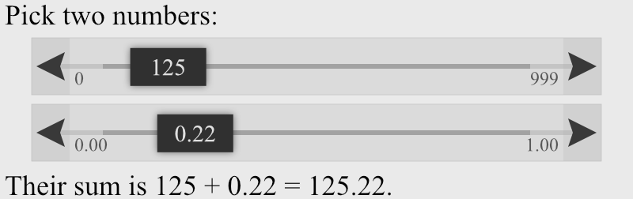

This above element is a **slider**. The `in` tag can be substituted with `Slider`. 

Features:

* Slider
  * Hold & Move: slider slider
  * Double-tap/click: Change value by custom input
* Arrows
  * Tap/hold: move slider in given direction
  * Double tap/click: Move slider to min/max

This substitutes combo boxes and sliders for a single element. The purpose for this being that the above slider is now device-independent in its behaviour.

> Combo boxes have been removed. They are generally specific to large devices. Device-specific controls have been removed. The gauge has been designed to be device-independent.

### Breaks

Breaks are to add breaks in between lines. There are two types of breaks in Z: the soft break and the hard break. The **soft break** is for line breaks and adding spacing between paragraphs if desired. The **hard break** is for adding a break between two paragraphs, and generally adds a line between them. Use `<br>` for a soft break and `<Br>` for a hard break.

```html
<p/>
Lorem ipsum dolor sit amet, consectetur adipiscing elit. Cras et blandit justo. Donec ac sapien ornare, sagittis tellus quis, condimentum justo. Aenean porta felis tincidunt ultrices sodales. Nullam ut lacinia mi. Vestibulum egestas euismod elit quis consectetur. Curabitur luctus ex et ipsum dictum, ornare malesuada purus dictum. In hac habitasse platea dictumst. Nulla bibendum, orci laoreet cursus accumsan, nunc diam commodo lorem, nec pulvinar felis dui eu ante. Sed sed metus nec mi lacinia luctus ut eget risus. Interdum et malesuada fames ac ante ipsum primis in faucibus. Praesent quis mauris mauris. Nulla tempus et mauris non eleifend. Donec tempor quam nec orci elementum, quis placerat massa gravida. Fusce sagittis felis in dolor fringilla, ut tincidunt urna feugiat. Nam et magna dui. Aenean sed iaculis dui.
</p>

<br>

<p/>
Vestibulum cursus urna in justo tempus tempus. Suspendisse ullamcorper fringilla est non sagittis. Nam ut molestie purus, sit amet semper dolor. Aenean malesuada ligula ut velit convallis, sit amet porttitor ante viverra. Ut quis bibendum dolor. Duis pulvinar ex nec consectetur malesuada. Vivamus fermentum tellus eu molestie faucibus. Nam luctus aliquet lacus, non gravida dui accumsan sed. Integer eget tempus nulla. Integer quis pretium purus. Donec at tincidunt turpis. Aliquam et enim mollis diam dapibus iaculis ut at nibh. Vestibulum libero quam, convallis eget semper pulvinar, aliquet et turpis.
</p>

<Br>

<p/>
Lorem ipsum dolor sit amet, consectetur adipiscing elit. Sed lectus tortor, vestibulum elementum varius vel, hendrerit sed ante. Aenean nisl sem, pretium eu tincidunt eu, condimentum ac sapien. Etiam at erat sapien. Nulla pharetra auctor risus, at molestie nisi sagittis nec. Donec tempus libero suscipit ligula interdum molestie. Fusce id auctor risus. Vestibulum sed dolor augue. Sed posuere tincidunt nisi. Quisque luctus justo id tellus consectetur vestibulum. Curabitur eget rutrum purus. In eros mauris, aliquam nec condimentum in, malesuada sit amet odio. Nullam venenatis vel tortor ut placerat. Nullam condimentum, massa at rutrum imperdiet, nisi ante vestibulum est, tempor dictum turpis est nec mi. Donec ullamcorper dictum mauris, vel auctor neque rhoncus et.
</p>
```

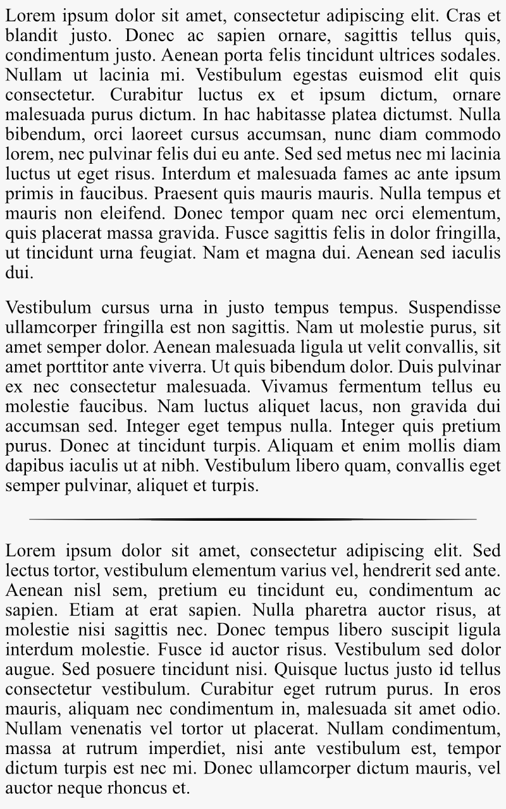

Alternatively, `</p/br/p/>` may be used for continuity.

```html
<p>
Lorem ipsum dolor sit amet, consectetur adipiscing elit. Cras et blandit justo. Donec ac sapien ornare, sagittis tellus quis, condimentum justo. Aenean porta felis tincidunt ultrices sodales. Nullam ut lacinia mi. Vestibulum egestas euismod elit quis consectetur. Curabitur luctus ex et ipsum dictum, ornare malesuada purus dictum. In hac habitasse platea dictumst. Nulla bibendum, orci laoreet cursus accumsan, nunc diam commodo lorem, nec pulvinar felis dui eu ante. Sed sed metus nec mi lacinia luctus ut eget risus. Interdum et malesuada fames ac ante ipsum primis in faucibus. Praesent quis mauris mauris. Nulla tempus et mauris non eleifend. Donec tempor quam nec orci elementum, quis placerat massa gravida. Fusce sagittis felis in dolor fringilla, ut tincidunt urna feugiat. Nam et magna dui. Aenean sed iaculis dui.

</p/br/p/>

Vestibulum cursus urna in justo tempus tempus. Suspendisse ullamcorper fringilla est non sagittis. Nam ut molestie purus, sit amet semper dolor. Aenean malesuada ligula ut velit convallis, sit amet porttitor ante viverra. Ut quis bibendum dolor. Duis pulvinar ex nec consectetur malesuada. Vivamus fermentum tellus eu molestie faucibus. Nam luctus aliquet lacus, non gravida dui accumsan sed. Integer eget tempus nulla. Integer quis pretium purus. Donec at tincidunt turpis. Aliquam et enim mollis diam dapibus iaculis ut at nibh. Vestibulum libero quam, convallis eget semper pulvinar, aliquet et turpis.

</p/Br/p/>

Lorem ipsum dolor sit amet, consectetur adipiscing elit. Sed lectus tortor, vestibulum elementum varius vel, hendrerit sed ante. Aenean nisl sem, pretium eu tincidunt eu, condimentum ac sapien. Etiam at erat sapien. Nulla pharetra auctor risus, at molestie nisi sagittis nec. Donec tempus libero suscipit ligula interdum molestie. Fusce id auctor risus. Vestibulum sed dolor augue. Sed posuere tincidunt nisi. Quisque luctus justo id tellus consectetur vestibulum. Curabitur eget rutrum purus. In eros mauris, aliquam nec condimentum in, malesuada sit amet odio. Nullam venenatis vel tortor ut placerat. Nullam condimentum, massa at rutrum imperdiet, nisi ante vestibulum est, tempor dictum turpis est nec mi. Donec ullamcorper dictum mauris, vel auctor neque rhoncus et.
</p>
```

This produces the exact same result as before.

### Grids

Grids can either be defined by their rows or columns.

If the number of cells in each row/column aren’t the same, the grid will add empty cells for that row/column. 

```html
<grid/>
	<row/>
		<cell/>1</cell>
		<cell/>2</cell>
		<cell/>3</cell>
		<cell/>4</cell>
	</row>
	<row/>
		<cell/>5</cell>
		<cell/>6</cell>
		<cell/>7</cell>
	</row>
	<row/>
		<cell ((),())/>8</cell> <!-- Multiple arguments better off styled like this -->
		<cell/></cell>
		<cell/></cell>
		<cell/></cell>
	</row>
</grid>
```

Arguments:

* Breadth: Relative sizing of row/column to other row/columns
* Stretch: How many other columns/rows the cell replaces

### References

References links to external pages or images.

#### Links

Links use the `a` tag. You can use this to link to other files, images, or pages. By itself, the `a` tag shows a preview if possible. 

```html
<p/>
    Here's a link to <a (www.google.com/)/>Google</a>.
</p>

<p/>
    Here's another link to Google:
</p>
<a (www.google.com/)>
```

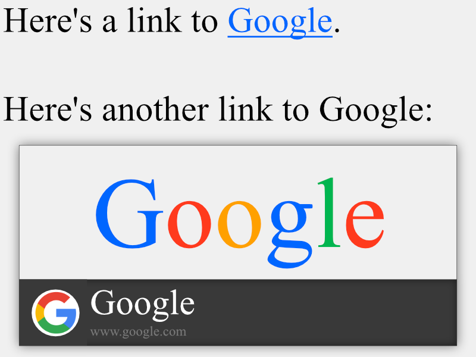

The lower component with the black background is called a **precis**. To hide the precis, add a `0` to the second argument:

```html
<A (www.google.com/, 0)/>
	Here's another link to Google. 
</A>
```

`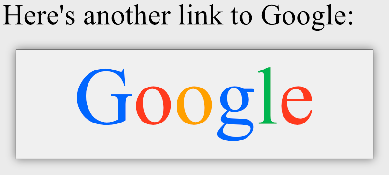

## Inline Code

Code can generally be inserted anywhere with `{ }`. For this, you’ll need to go over the [programming](../4 Programming/_Programming).

```html
<body/>
    2 ^ 4 is {2 ^ 4}.
</body>
```


## Fusion

**Control Fusion** is the combination of two or more controls. 

For example a a **menu** is a list of linked buttons. The fusion would look like this: `list a button`:

```html
<list a button/>
	<li ("ref1")/>One</li>
	<li ("ref2")/>Two</li>
	<li ("ref3")/>Three</li>
	<li ("ref4")/>Four</li>
</list>
```

This actually expands to:

```html
<list/>
	<li a("ref1") button/>One</li>
	<li a("ref2") button/>Two</li>
	<li a("ref3") button/>Three</li>
	<li a("ref4") button/>Four</li>
</list>
```

That’s due to the internal coding of lists. You’ll learn more about how this works in the [Customs](../3 Customs/_Customs.md) section. 

For another example, a **menu** is a list of buttons that link to a different page. A **drop**(down) is a list options that pop down once the dropdown button is selected. A dropdown menu can thus be made as follows:

```html
<drop menu/>
	<li/>One</li>
	<li/>Two</li>
	<li/>Three</li>
	<li/>Four</li>
</drop menu>
```

Rules for control fusion: Similar to inheriting both classes at the same time.


## Variables

For those of HTML/CSS background, variables substitute ids and classes. Variables can later be used to have their design edited via a relevant Z Design file. A single variable may be used with multiple elements.

For example:

```html
<int @num/>12</int>
<int @num/>15</int>
<double @num/>3.14</double>
<string @num/>43</string>
<int @i/>-6</int>
```

## Inline Design

Design changes can be made inline. This feature is offered so as to not create a whole separate file for when there’s only minor changes to be made. 

As an introduction, the design component is grouped into 3 components:

* `facet`: for the size, dimensions, and positioning of the element
* `style`: for the appearance of the element: includes the font, border styling, and coloring of the element
* `react`: for handling reactions to various events such as mouse clicks and keyboard presses

To access these, we have a keyword identifier `|`.

To make changes in the position or dimensions, for example, we insert the `|facet` as follows:

```html
<button |facet {pos: {pos+(20,20)px};}/>
    Click me!
</button>
```

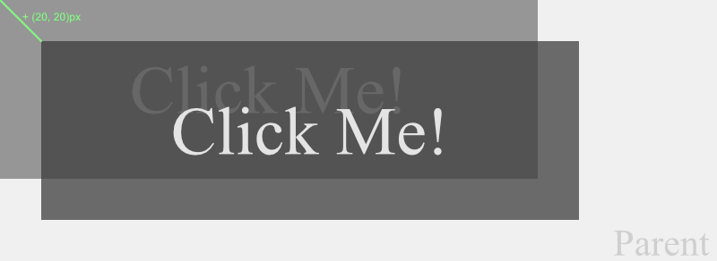

The above demonstrates how the code changes the button’s position.

Introduction to inline designing is a good place to end this.

------

## HTML Contrasts

* The ZLF (Z language framework) is designed to be device-independent, so device specific controls such as combo boxes have removed.