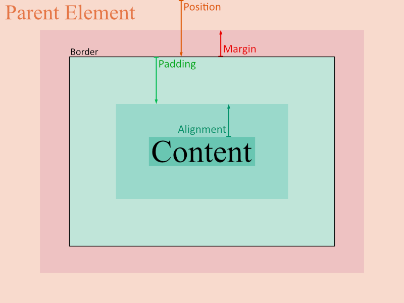
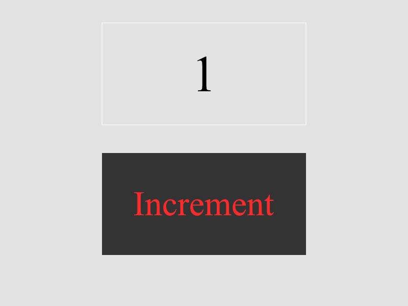
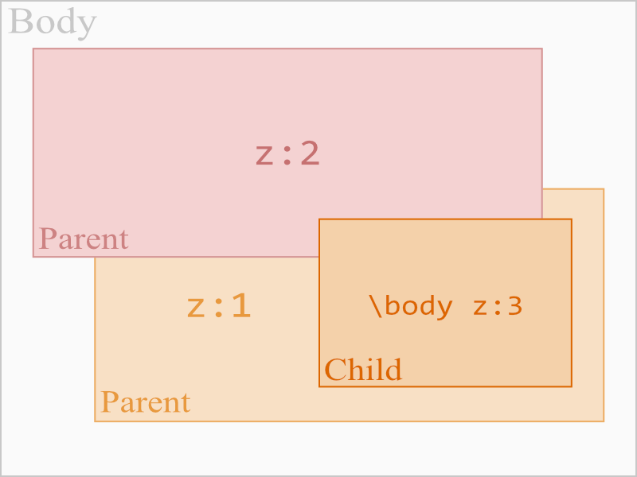

# Modular Styling

A **module** is a type of element in a webpage such as a paragraph, heading, image, or div. In short, they're the tags. But modules are a little more general here. M allows users to create their own modules/tags. Modules allow users to create custom web components, like dropdown menus. The syntax for styling is based heavily on CSS, with some modifications for simplicity.

(As of March 27, 2020, file extensions .mc and .mdc are both available from a check on Wikipedia.)

**Notes:**

- ***Everything is with respect to the parent element in M.*** If you want to fix something in the body, move it inside the body element. Otherwise, it will remain fixed ***within its parent***. If its parent moves, it will inevitable move along with it. There are numerous reasons for this:
  - **Semantic Consistency.** This is to say we maintain the idea of what it means to be a parent element. Allowing users to control the position of a label in the entire body of the webpage (as in CSS's fixed/sticky positioning) inside a div raises the question of why the label is placed in the div and simply not placed in the body, where it can be moved freely.
  - **Aesthetic appeal.** Concepts like overflow make no sense from an aesthetic point of view. Their presence offers users the freedom, should they choose to use it, but it is, aesthetically absurd - the overflow of text raises the question of why not simply stretch the parent element to keep up with the text. Concepts like overflow also defy the rule of semantic consistency - why have the block of div with its dimensions as parent of the element if the text was simply going to overflow it? The alternative solution here is `height:flex` which updates the height of the element as the content changes.
  - **Common Intent.** Let's say I want a graphical drawing element. Should I position and control the curve relative to the body, or to the element itself? In general, as far as common intentions go for having such a graphical drawing element, controlling the points on the curves relative to the element itself makes far more sense. Of course, the code for behaviour of the mouse clicks will consider the click position relative to the element itself as well. The common intent covers the common intention for why an element is used in the way it is.
  - **Ease of Development.** This is a point that argues it is easier on the developers coding the parsers of M to have an easier time. When everything is relative to the parent, they only need to think about how an element relates to its parent, as opposed to the whole picture. Furthermore, this forces web developers to write readable and intuitive code, as they can't simply place an element inside a div and hope to move it outside the element. 
- Many CSS concepts are removed or changed for simplicity. 
  - CSS's **Display** isn't included. Everything is the CSS inline-block by default. Setting width and height to `flex` will make anything inline. To create a block, simply add a line break.
  - CSS's **Text-Align** not included. Use the `align` property of `p` (paragraph), or `h1` or `li`. It will generally be implied that each word needs to be separately aligned.
  - CSS's **Static** position not included. Positions are relative by default.
  - CSS's **Float** property is removed. To make an item float to the right end of its parent, set `x` to `100%` in `placement`.
  - CSS's **Outline** is largely useless, and can be done using already existing code. It is removed. (An external div with different padding colour can be used to implement this.)
  - CSS's **Fixed** and **Sticky** position options are removed. In M, there is no options for restyling position. Instead, a `drag` property is added under `placement` to control the movement of elements. This, I considered to be a neater alternative. The entire concept of **Position** works differently in M. You state the value of the desired position of the element, as again, there is no option for restyling the type of the position.
  - CSS's **Overflow** property is removed. There is no option for overflow. It is aesthetically absurd. A similar alternative is the `height: flex` value. Though this is different than overflow as it updates height based on its contents. 
  - 


## Coordinate System


## Traits

The trait types of an element categorize its traits to make it easier to control the overall layout of the element. M has 4 trait types: placement, appearance, and behaviour.

**Placement** affects the overall positioning, sizing, and movement of the element. 
**Appearance** controls the appearance of the element.
**Behaviour** affects how the element behaves in various situations (on hover, on click, etc.)

### Placement

Similar to the box model in CSS. The concept of position is added as part of the M box model, and the border component is moved to appearance. In addition, the alignment is also added as part of the box model.

The padding and margin can also be used for alignment.



It's worth noting that these all use both % and pixels for measurement. A float of 100% moves the object to the left.

* **Spread.** Determines the default spread of child elements. `0` represents no spread. `1` represents equally spread out elements. 
* **Alignment.** Relative positioning of child elements to content. (Note: there's no `text-align`. If the block is a text element, it will be implicitly aligned according to the alignment). (From *edge of content* to within padding)
* **Padding.** Controls how close the content is allowed to get to edges of the block. (From *edge of block* to *edge of content*)
* **Size.** The size of the block itself, containing the padding with the content. If the horizontal or vertical padding is greater than or equal to a total of 100%, then the content is distributed in proportion of the padding ratio. (ie. If the horizontal padding is left 30% and right 70%, the content is centered to 30% from the left). Use `size.x` for width and `size.y` for height. (Total size of *block*)
* **Border.** Controlled in `appearances`. Precisely speaking, it's outside the padding (as opposed to being inside or along/over the edge of padding). Use `border.x` and `border.y` for horizontal and vertical components respectively. If greater than margin, it will be equal to the size of the margin. (Line outside of *block*, inside of *margin*.)
* **Margin.** The extra spacing away from the block that nearby elements must provide to this specific block. Restricts the border. (Space from the *block*, to the *nearest possible sibling element*)
* **Position.** Either the relative or final position may be set, but not both. If both are set, then M will take the one defined later. The relative position will change as the final is changed and vice versa. `abs abs.x abs.y`  denote the absolute position traits of the element, and cannot be changed. `rel rel.x rel.y` denote the relative positions. For final position, use `pos pos.x pos.y`. 

The border is a part of the appearance, not the placement in M.

***Why so many layers?***

To answer this, we first need to look at things relative to the <u>border</u>. 

* The padding and alignment determine the overall placement of the content **within the block**. Along the edge of the block, we have the border. 
* Outside the border, the margin and position determine the placement of the *block itself* **within the parent**. And that's how we get all the layers we do.

#### Position

##### Relative and Absolute

The concept of relative and absolute position are all relative to the parent.


##### Z-Index

Z-Index in M works a little differently. That is, in M, the z-index only affects relative behaviour with sibling elements. I can never change the z-index to hide an object, except by placing a sibling element on top of it. Furthermore, you can not change the z-index to move an element "behind" the parent, even with a negative value. We have `visibility:hide` for hiding elements. 


Again, it's a reminder that **everything in M is strictly relative to the parent element**.

The parent of each "Parent" above is the "Body" element. Each child item is the child of the similarly coloured-parent.

The z-index in M works like this:

***If a sibling element has a higher z-index, it and its child items will overlap the element with the lower z-index, as well as all its child elements.***

The z-index is set as follows:

```css
element {
placement {z: 2;}
}
```

#### Alignments

The `align` property sets the default alignment of the child items. This can be overridden by a child item's float property if desired.

#### Drag

Controls how the element moves relative to the scrolling of its parent element. 

* A `drag` of `0` represents the block remains in place, regardless of the scroll. This is equivalent to the CSS's fixed element. 
* A `drag` of `1` is the default, and it represents the element moving along with the scroll. 
* Use `drag: sticky` for the CSS sticky feature. Note: the sticky is only implemented relative to the parent element.

Again, since everything is relative to the parent item, the drag is only compared to the scrolling of the parent item, not the page.

### Appearance

#### Size

Maximum Content Size = Size - Padding.

#### Colour

Colour uses both RGB and RGBA formats. The colouring code is also generalized.

* `#G`: Single Precision Greyscale.
* `#GG`: Double Precision Greyscale.
* `#RGB`: Single Precision Colour.
* `#RGBA`: Single Precision Transparent Colour.
* `#RRGGBB`: Double Precision Colour.
* `#RRGGBBAA`: Double Precision Transparent Colour.

#### Visibility 

The visibility model affects how the content is shown or hidden.

* scroll.: adds a scroll bar when content is larger than its maximum width or height
  * auto: shows the scroll bar only when necessary
  * fix: always shows the scroll bar
* collapse
* hide
* restrict: restricts the content to remain within the padding, without ever adding a scrollbar.

Note that restrict does nothing when either height or width are set to flex.

 The appearance is about the colours and the border, which control the overall appearance of the element.

There are two main colours: fore and back. Besides them, the rest is determined by the module.

### Behaviour

The behaviour affects the control's behaviour in various situations . such as hovering, clicking, etc.

### Example

Colour #f is equivalent to #fff which is equivalent to #ffffff. @counter gets an element with an "id" of "counter". Similarly #3 = #333 = #333333.

```css
body {
placement { back: #e3e3e3; }
}

int, button {
placement {
	X: 50% 50%; /* centralize items horizontally on page */
    pad: 50%; /* centralize text horizontally an vertically */
	size: 400px 200px; /* width = 400px and height = 200px */
}
}

@counter { 
placement { pos: 200px 50px; }
appearance { border: #f 1px; }
}

button {
placement { pos: 200px 300px; size.x: 200px; }
appearance { fore: #ff2b2b; back: #3; }
behaviour { mouse { click: { @counter.content++; } } }
}
```

```html
<body>
    <int counter>1</int>
    
    <button>Add number</button>
</body>
```



Visibility doesn't need to change. The text won't be overflowing the boundary, we want the button to show, and it is on restrict by default.

### Trait Tree

* `placement`
  * Position
    * Relative Position: `rel rel.x rel.y` 
    * Absolute Position: `abs abs.x abs.y`
    * Final Position (cannot be edited): `pos pos.x pos.y`
    * Z-Index: `z`
  * Margin: `margin margin.x margin.y`
  * Size: `size size.x size.y`
  * Padding: `pad pad.x pad.y`
  * Alignment: `align align.x align.y` 
  * Drag: `drag drag.x drag.y`
* `appearance`
  * Visibility: `visibility`
  * Border: `border`
  * Foreground Colour: `fore`
  * Background Colour: `back`
* `behaviour`
  * Mouse: `mouse`
    * Click: `click`
    * Double-Click: `click2`
    * Hover: `hover`
    * Move: `move`
    * Scroll: `scroll`
  * Keyboard: `key`
  * Time: `time`

## Code Insertion

For code insertion in any part of the code, use `{ }`.

Example:

```css
button {
placement { rel.x: {rel.x+20}px; }
}
```

The programming language used by M will be covered later. 

# Modular Programming

The programming in M is purely event driven. 

## Element Access

In M, the elements are defined as follows:

```html
<body>
    <int i>5</int> <!-- 1 -->
    <string str>A string.</string> <!-- 2 -->
    <double,string ,st>3.1</double,string> <!-- 3 -->
    <string str>Another string with a previous "variable"</string> <!-- 4 -->
</body>
```

Here's a quick explanation of the code above:

1. An integer element `i` with the number 5.
2. A string element `str` associated to "A string.".
3. An element associated to two tags: one double, one string. The string part has the variable `st`, the double does not.
4. A reuse of the previous variable `str`. 

Accessing element variables is done with `@`. Accessing element tags is done directly by explicit stating the tag. Self-referencing is done through the `@`.

```css
string @str { /* all string variables named "str" */
    behaviour {
        mouse:click {
            @ += "r"; /* appends 'r' to the end of the string on click */
            int @i++; /* incremenets integer "i" by 1 */
        }
    }
}
```

## Composition

Composition allows individuals to make traits or elements relative to something other than their parent. 

As this does go against the semantic consistency of inheritance, I'd personally not recommend it unless absolutely necessary (such as 3d graphics - where parts of one object may be partially in front of and behind another). But, it offers developers more "freedom", should they ever need it. 

### Constituents

Inheritance in M works similarly to CSS. However, instead of a space, a `.` is used for inheritance. For example, `p.span` receives all span elements in paragraphs. 

Beyond inheritance, the `.` is also used for trait components. For example, let's say you want to only change the horizontal position of an element. You'd do something like this:

```css
pos.x: 5;
```

You should think of the `.` as represent a way to access *internal* concepts. In the context of inheritance of elements, this refers to child elements inside their parent elements. In the context of traits, this refers to internal traits of composite traits - that is, position being the composite trait composed of internal traits x- and y- positions.

In general, the `.` is the **constituent operator**. Child elements are *constituents* of their parent elements. Internal traits are *constituents* of their composite traits. That is, the constituent operator accesses constituents. 

You've seen this in action already.

To access children of children, use `..`.

### Composition

To access the parent element, use `\`. To access the nearest parent paragraph of an element (should it have one), use `\p`. To access parents of parents, use `\\`.

```css
@child {
	placement {
        @\body z: 3; /* alternatively, use \\ in this case */
    }
}
```



You may also do this for traits: `x\pos: 12px`. 