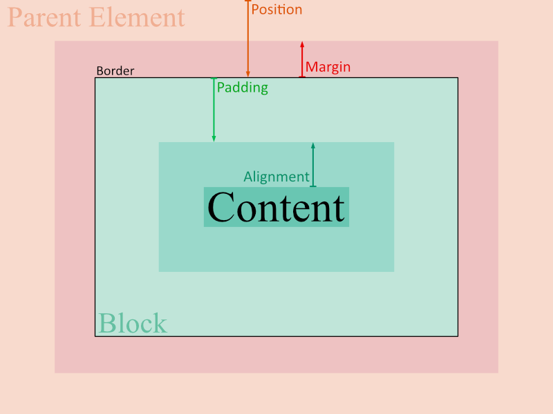

# Control Styling

A **control** is a type of element in a webpage such as a paragraph, heading, image, or div. In short, they're the tags. But controls are a little more general here. M allows users to create their own controls/tags. Controls allow users to create custom web components, like dropdown menus. The syntax for styling is based heavily on CSS, with some modifications for simplicity.

(As of March 27, 2020, file extensions .mc and .mdc are both available from a check on Wikipedia.)

**Notes:**

- ***Everything is with respect to the parent element in M.*** If you want to fix something in the body, move it inside the body element. Otherwise, it will remain fixed ***within its parent***. If its parent moves, it will inevitable move along with it. There are numerous reasons for this:
  - **Semantic Consistency.** This is to say we maintain the idea of what it means to be a parent element. Allowing users to control the position of a label in the entire body of the webpage (as in CSS's fixed/sticky positioning) inside a div raises the question of why the label is placed in the div and simply not placed in the body, where it can be moved freely.
  - **Aesthetic appeal.** Concepts like overflow make no sense from an aesthetic point of view. Their presence offers users the freedom, should they choose to use it, but it is, aesthetically absurd - the overflow of text raises the question of why not simply stretch the parent element to keep up with the text. Concepts like overflow also defy the rule of semantic consistency - why have the block of div with its dimensions as parent of the element if the text was simply going to overflow it? The alternative solution here is `height:flex` which updates the height of the element as the content changes.
  - **Common Intent.** Let's say I want a graphical drawing element. Should I position and control the curve relative to the body, or to the element itself? In general, as far as common intentions go for having such a graphical drawing element, controlling the points on the curves relative to the element itself makes far more sense. Of course, the code for reaction of the |mouse press will consider the press position relative to the element itself as well. The common intent covers the common intention for why an element is used in the way it is.
  - **Ease of Development.** This is a point that argues it is easier on the developers coding the parsers of M to have an easier time. When everything is relative to the parent, they only need to think about how an element relates to its parent, as opposed to the whole picture. Furthermore, this forces web developers to write readable and intuitive code, as they can't simply facet an element inside a div and hope to move it outside the element. 
- Many CSS concepts are removed or changed for simplicity. 
  - ~~CSS's **Display** isn't included. Everything is the CSS inline-block by default. Setting width and height to `flex` will make anything inline. To create a block, simply add a line break.~~
    - Replaced with `|facet flow`. Use `flow:x` for inline and `flow:y` for block. Inline-blocks overflow their lines and are not a simple option. Paragraphs are, in a sense, divided into “hidden tags” which are lines. The inline-block option overflows these hidden tags. The reasoning for overflowing parent elements is explained below, a few points later. 
  - CSS's **Text-Align** not included. Use the `align` property of `p` (paragraph), or `h1` or `li`. It will generally be implied that each word needs to be separately aligned.
  - CSS's **Static** position not included. Positions are relative by default.
  - CSS's **Float** property is removed. To make an item float to the right end of its parent, set `x` to `100%` in `facet`.
  - CSS's **Outline** is largely useless, and can be done using already existing code. It is removed. (An external div with different padding colour can be used to implement this.)
  - CSS's **Fixed** and **Sticky** position options are removed. In M, there is no options for restyling position. Instead, a `drag` property is added under `facet` to control the movement of elements. This, I considered to be a neater alternative. The entire concept of **Position** works differently in M. You state the value of the desired position of the element, as again, there is no option for restyling the type of the position.
  - CSS's **Overflow** property is removed. There is no option for overflow. It is aesthetically absurd. A similar alternative is the `height: flex` value. Though this is different than overflow as it updates height based on its contents. 
- ***The programming is purely event-driven OOP.*** All programming is primarily focused on event handling. To deal with repeatable code, OOP is added. 
  - Background programming such as timers/clocks are handled with controls mentioned in the head.
- (Note: It’ll likely be cleaner if `|facet` is moved outside and the facet of all variables is addressed at once, as opposed to variable by variable).
- Semicolons removed. The semicolon offers an additional purpose in our code. 

## Traits

The trait types of an element categorize its traits to make it easier to control the overall layout of the element. Z has 3 trait types: facet, style, and react.

**Facet** affects the overall positioning, sizing, and movement of the element. 
**Style** controls the style and overall appearance of the element.
**React** affects how the element behaves in various situations (on hover, on press, etc.)

### Facet

Similar to the box model in CSS. The concept of position is added as part of the M box model, and the border component is moved to style. In addition, the alignment is also added as part of the box model.

The padding and margin can also be used for alignment.



It's worth noting that these all use both % and pixels for measurement. A float of 100% moves the object to the left.

* **Children Positioning.**
  * **Flow.** Represents the continuity of the child elements. 
    * **Alignment.** Relative positioning of child elements to content. (Note: there's no `text-align`. If the block is a text element, it will be implicitly aligned according to the alignment). (From *edge of content* to within padding) (Should this be in children or internal positioning?)
    * **Angle.** The direction of the flow.
    * **Rest.** How additional elements are added once the end of the flow direction is reached. (xbool: 0 = finish, 1 = continue as usual, and auto = split contents)
  * **Spread.** Determines the default spread of child elements. `0` represents no default spread. `1` represents equally spread out elements.
* **Internal Positioning.** 
  * **Padding.** Controls how close the content is allowed to get to edges of the block. (From *edge of block* to *edge of content*)
* **Border.** Controlled in `styles`. Precisely speaking, it's outside the padding (as opposed to being inside or along/over the edge of padding). Use `border.x` and `border.y` for horizontal and vertical components respectively. If greater than margin, it will be equal to the size of the margin. (Line outside of *block*, inside of *margin*.)
  * **Size.** The size of the block itself, containing the padding with the content. If the horizontal or vertical padding is greater than or equal to a total of 100%, then the content is distributed in proportion of the padding ratio. (ie. If the horizontal padding is left 30% and right 70%, the content is centered to 30% from the left). Use `size.x` for width and `size.y` for height. (Total size of *block*)
* **External Positioning.**
  * **Margin.** The extra spacing away from the block that nearby elements must provide to this specific block. Restricts the border. (Space from the *block*, to the *nearest possible sibling element*)
  * **Position.** Either the relative or final position may be set, but not both. If both are set, then M will take the one defined later. The relative position will change as the final is changed and vice versa. `abs abs.x abs.y`  denote the absolute position traits of the element, and cannot be changed. `rel rel.x rel.y` denote the relative positions. For final position, use `pos pos.x pos.y`. 

The border is a part of the style, not the facet in M.

#### Flow

Represents the default positioning of each consecutive child item. 

##### Axis

Examples:

* The elements in a paragraph flow horizontally. So the paragraph element has `flow.axis:x`.
* The elements in a body flow vertically. So the body element has `flow.axis:y`. 

All elements will use remaining space in the other direction of their parent element when filled.


Note the order in which the numbers are written. In `flow.axis:x`, the numbers are in order from left to right. In `flow.axis:y`, the numbers are ordered from left to right. In `flow.axis: y`, they’re ordered top to bottom.

##### Alignments

The `align` property sets the default alignment of the child items. This can be overridden by a child item's float property if desired.


You may also use `align: 0` for centralizing child elements.

The `align` trait also takes a second input, for the secondary alignment, in case of “overflow”. 

##### Spill

The `flow.spill` trait determines how the child elements flow once the limit in a given direction is reached.

The axis set by `flow.axis` is the *primary axis* for the flow. The spill determines how the elements continue to flow.

In Z, when there are more elements in their given flow direction, they start a new “line”, just as text starts a new line once it reaches its end of line. 

Values:

* `bool`:
  * 0: Stops adding new items.
* `align.value`: aligns the content in the secondary axis. By default, this is `-1`. 

> This is **not** the same as CSS’s overflow property. Flowing beyond the border of a parent element is not possible in Z.


#### Position

##### Relative and Absolute

The concept of relative and absolute position are all relative to the parent.


##### Z-Index

Z-Index in M works a little differently. That is, in M, the z-index only affects relative react with sibling elements. I can never change the z-index to hide an object, except by placing a sibling element on top of it. Furthermore, you can not change the z-index to move an element "behind" the parent, even with a negative value. We have `visibility:hide` for hiding elements. 


Again, it's a reminder that **everything in M is strictly relative to the parent element**.

The parent of each "Parent" above is the "Body" element. Each child item is the child of the similarly coloured-parent.

The z-index in M works like this:

***If a sibling element has a higher z-index, it will overlap the element with the lower z-index, as well as all its child elements.***

The z-index is set as follows:

```css
|facet {
element {z: 2}
}
```

#### Spread

The default spread of the child elements.

#### Drag

Controls how the element moves relative to the scrolling of its parent element. 

* A `drag` of `0` represents the block remains in facet, regardless of the scroll. This is equivalent to the CSS's fixed element. 
* A `drag` of `1` is the default, and it represents the element moving along with the scroll. 
* Use `drag: auto` for the CSS sticky feature. Note: the sticky is only implemented relative to the parent element.

Again, since everything is relative to the parent item, the drag is only compared to the scrolling of the parent item, not the page.

### Style

#### Size

Maximum Content Size = Size - Padding.

#### Tint

Tint uses both RGB and RGBA formats. The colouring code is also generalized.

* `#G`: Single Precision Greyscale.
* `#GA`: Single Precision Transparent Greyscale.
* `#RGB`: Single Precision Colour.
* `#RGBA`: Single Precision Transparent Colour.
* `#RRGGBB`: Double Precision Colour.
* `#RRGGBBAA`: Double Precision Transparent Colour.

Tints also use the saturation and value from the HSV model (we use HSV over HSL for the slight benefit in efficiency). Both saturation and value also take hexadecimal values. The notation for saturation and value is the following:

```C#
#G & S ^ V
#GA & S ^ V
#RGB & S ^ V
#RGBA & S ^ V
#RRGGBB & SS ^ VV
#RRGGBBAA & SS ^ VV
// Note: need to swap & with ^, I think.
```

The `color` trait represents two tints: fore and back, in that order. 

#### Exist

The `exist` trait affects how the element is shown or hidden.

* 0: hides the element as if it was never there.
* auto: hides the element as if it is an invisible block which other elements cannot pass through.
* 1: shows the content.

The style is about the colours and the border, which control the overall style of the element.

Note how the blue and green element below change and move as the blue element’s `exist` value changes.

The blue text always corresponds to the `exist` value of the blue element and the green text always corresponds to the `exist` value of the green element. 


#### Scroll

* scroll: adds a scroll bar when content is larger than its maximum width or height.
  * auto: exists the scroll bar only when necessary
  * 0: Always hide the scroll bar (default)
  * 1: always exists the scroll bar


#### Font

Sets the font of any internal text.

```css

```


### React

The `react` section affects the control's reactions to various situations such as hovering, pressing, etc.

#### Mouse Events

During mouse event computations, the computed position of the mouse will **always** be relative to the element.


#### Key Events


#### Time Events


### Example

Colour `#f` is equivalent to `#fff` which is equivalent to `#ffffff`. `@counter` gets an element with an "id" of "counter". Similarly `#3 = #333 = #333333`.

```css
|facet {
    body {
        back: #e3e3e3
    }
    
    int, button {
        pos.x: 50% 50%
        pad: 50%
        size: 400px 200px
    }
    
    @counter {
        pos: 200px 50px
    }
    
    button {
        pos: 200px 300px
        size.x: 200px
    }
}

|style {
    @counter { border: #f 1px }   
    button { 
        fore: #ff2b2b
        back: #3 
    }
}

|react {
    button {
        |mouse { press: { @counter.content++ } }
    }
}
```

```html
<body>
    <int counter>1</int>
    <button>Increment</button>
</body>
```


Visibility doesn't need to change. The text won't be overflowing the boundary, we want the button to exist, and it is on restrict by default.

### Trait Tree

* `|facet`
  * Position
    * Relative Position: `rel rel.x rel.y` (area span span)
    * Absolute Position: `abs abs.x abs.y` (area span span)
    * Final Position (cannot be edited): `pos pos.x pos.y` (area span span)
    * Z-Index: `z` (int)
  * Margin: `margin margin.x margin.y` (area span span)
  * Size: `size size.x size.y` (area span span)
  * Padding: `pad pad.x pad.y` (area span span)
  * Alignment: `align align.x align.y` (area span span)
  * Drag: `drag drag.x drag.y` (xbool[2] xbool xbool)
  * Flow: `flow` (axis)
* `|style`
  * Visibility: `visibility` (enum)
  * Scroll: `scroll` (xbool - extended Boolean)
  * Border: `border` (tint span[4])
  * Colour: `color`
    * Foreground Colour: `fore` (tint)
    * Background Colour: `back` (tint)
* `|react`
  * mouse: `|mouse` [source]
    * Press: `press` [event]
    * Double-Press: `press2` [event]
    * Hover: `hover` [event]
    * Move: `move` [event]
    * Scroll: `scroll` [event]
  * keyboard: `|key` [source]
  * Time: `|time` [source]
  * Specifics

# Advanced Styling

## Code Insertion

For code insertion in any part of the code, use `{ }`.

Example:

```css
|facet {
    button { rel.x: {rel.x+20}px }
}
```

The programming language used by M will be covered later. 

## Advanced Features

* Facet: 3d layering
* Style: Shadows, blur, 3d, bevel, border shape, color edit
* React: Specific Events

### 3D Layering

3D layering can still be accomplished 

### Color Editing

* Photo coloring

#### Saturation


#### Value


* Saturation & Value
  * & `VV`

### Specific Events

Specific events are when events specific to a control occur.